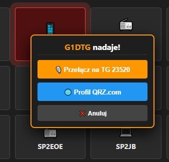
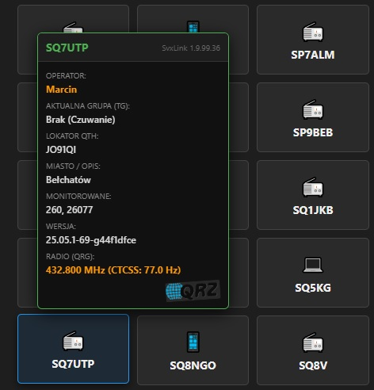
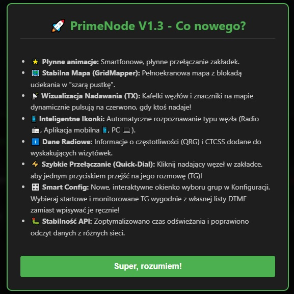

# PrimeNode - RPI V1 Hotspot System
### Powered by SvxLink | Developed by SQ7UTP

Witamy w oficjalnym repozytorium systemu **PrimeNode**. 
Jest to zaawansowane, lekkie i nowoczesne oprogramowanie dla hotspotów radiowych, oparte na systemie **Raspberry Pi OS** oraz silniku **SvxLink**. Projekt został stworzony od podstaw z myślą o intuicyjnej obsłudze (Dashboard WWW), stabilności (System plików Read-Only/Logi w RAM) oraz elastyczności konfiguracji (Roaming Sieciowy i wsparcie dla różnego hardware'u).
PrimeNode to projekt rozwojowy, tworzony z myślą o prostocie i stabilności – bez zbędnych „wodotrysków”, za to z naciskiem na funkcjonalność. Starałem się pozbyć potencjalnych błędów. Jestem w pełni otwarty na Wasze uwagi, propozycje nowych funkcji oraz konstruktywną krytykę. Projekt ma charakter otwarty, więc jeśli masz pomysł na modyfikację lub usprawnienie kodu – śmiało modyfikuj lub daj znać! Budujmy to rozwiązanie wspólnie.

---

## 📥 GŁÓWNY OBRAZ SYSTEMU / MAIN SYSTEM IMAGE

Gotowy do wgrania obraz systemu (`.img`) znajduje się w sekcji **Releases** po prawej stronie tego repozytorium. Nie musisz kompilować kodu ręcznie – pobierz, wgraj i używaj.

👉 **[PRZEJDŹ DO POBIERANIA / GO TO RELEASES](../../releases)**

### 🛠️ Kompatybilność Sprzętowa / Hardware
* **Komputer:** Raspberry Pi Zero W, Zero 2W, 3, 3B, 3B+, 4
* **Radio:** Moduł SHARI / SA818 **LUB** zewnętrzny radiotelefon podłączony przez kartę dźwiękową USB (CM108) i piny GPIO.
* **Pamięć:** Karta microSD min. 8GB (Zalecane Class 10/A1)

---

## 🚀 Szybki Start / Quick Start

### 🔐 Dane Logowania / Credentials

| Usługa / Service | Login / User | Hasło / Password | Port / Address |
| :--- | :--- | :--- | :--- |
| **Terminal (SSH)** | `root` | `primenode` | 22 |
| **Dashboard WWW** | *(brak / none)* | *(brak / none)* | `http://primenode.local` lub adres IP (LAN IP) |
| **Web Terminal** | `root` | `primenode` | (via Dashboard) |
| **Tryb Ratunkowy AP** | SSID: `PrimeNode_AP` | `primenode123` | `http://192.168.4.1` |

*(Uwaga: Zalecamy zmianę domyślnego hasła `root` po pierwszym zalogowaniu komendą `passwd`)*

---

## ✨ Główne Funkcje / Key Features

System PrimeNode oferuje zestaw zaawansowanych funkcji ułatwiających codzienną pracę z hotspotem (Zaktualizowano w **V1.3**!):

1.  **🎛️ Smart Config (NOWOŚĆ!):**
    * Koniec z ręcznym wpisywaniem numerów grup TG w konfiguracji!
    * Kliknij pole *Startowe TG* lub *Monitorowane TG*, by otworzyć dotykowy panel wyboru.
    * System automatycznie zaciąga Twoje ulubione grupy prosto z Twoich własnych zakładek DTMF.

2.  **⚡ Szybkie Przełączanie (Quick-Dial) i Wizualizacja TX (NOWOŚĆ!):**
    * Gdy ktoś nadaje, jego kafelek na liście i znacznik na mapie dynamicznie pulsują na czerwono.
    * Kliknij pulsujący kafelek w zakładce Nodes, aby jednym przyciskiem natychmiast przełączyć swoje radio na grupę (TG), na której toczy się rozmowa.

3.  **📱 Inteligentne Ikony i Dane Radiowe (NOWOŚĆ!):**
    * Lista węzłów automatycznie rozpoznaje oprogramowanie stacji i przydziela ikonę: Radio (📻), Aplikacja mobilna (📱) lub PC (💻).
    * Najechanie na węzeł zdradza dokładną częstotliwość (QRG) oraz ton CTCSS korespondenta.

4.  **📻 Multi-Hardware (Wybór Radia):**
    * Wbudowana obsługa popularnych płytek nakładkowych **SHARI (SA818)**.
    * Tryb pracy ręcznej dla entuzjastów: możliwość podpięcia zewnętrznego radia ("ręczniaka") przez kartę dźwiękową USB z chipem **CM108**. System pozwala na samodzielne przypisanie pinów GPIO dla sygnałów PTT oraz COS z poziomu panelu WWW.

5.  **🆘 Tryb Ratunkowy Wi-Fi (Access Point):**
    * Jesteś w podróży lub zmieniłeś router? Żaden problem!
    * Jeśli urządzenie po uruchomieniu nie połączy się ze znaną siecią Wi-Fi, po 2 minutach automatycznie wygeneruje własną sieć ratunkową (`PrimeNode_AP`). Połącz się z nią, wpisz w przeglądarkę `http://192.168.4.1` i wygodnie dodaj nowe hasło do Wi-Fi z poziomu Dashboardu.

6.  **🌐 Network Roaming (Baza Sieci):**
    * Wbudowany menedżer sieci w zakładce *Konfiguracja*.
    * Możliwość zdefiniowania wielu serwerów (Reflektorów) z różnymi loginami/hasłami.
    * Szybkie przełączanie sieci kodami DTMF z radia: `555` + `ID` + `#`.

7.  **🔄 System Aktualizacji (OTA Update):**
    * Wbudowany mechanizm aktualizacji Dashboardu i skryptów systemowych.
    * Pobieranie poprawek i nowości jednym kliknięciem w zakładce *Zasilanie* (bez konieczności ponownego wgrywania obrazu na kartę).

8.  **📱 Inteligentny DTMF (Drag & Drop):**
    * Nowoczesny edytor przycisków z obsługą **przeciągania kafelków** (również na telefonie).
    * Tworzenie własnych zakładek i makr bez edycji plików tekstowych.

9.  **💻 Web Terminal (SSH):**
    * Pełny dostęp do konsoli systemowej bezpośrednio z przeglądarki.
    * Nie potrzebujesz Putty/Terminala – zarządzaj systemem z dowolnego urządzenia.

10. **🎚️ Audio Mixer GUI:**
    * Wbudowany mikser ALSA w Dashboardzie.
    * Precyzyjna regulacja poziomów (Mic Boost, ADC Gain, DAC Vol) suwakami – koniec z przesterowanym audio!

11. **🌍 Multi-Language (PL/EN):**
    * Pełne wsparcie dla języka **Polskiego** i **Angielskiego**.
    * Przełącznik języka interfejsu (flagi) oraz zmiana języka komunikatów głosowych SvxLink w Configu.

12. **🚀 Optymalizacja Systemu:**
    * Logi systemowe zapisywane w pamięci RAM (`/dev/shm`) – oszczędza kartę SD.
    * Auto-Proxy dla EchoLink (rozwiązuje problemy z LTE/GSM).

13. **📺 PrimeNode Monitor Support:**
    * Wbudowana obsługa zewnętrznych wyświetlaczy OLED dla dedykowanego oprogramowania monitorującego.

---

## 📺 PrimeNode Monitor (OLED)

System PrimeNode posiada wbudowaną integrację z autorskim oprogramowaniem monitorującym. Obsługuje ono wyświetlacze **OLED 1.3 cala oraz 2.42 cala**, prezentując kluczowe parametry pracy węzła w czytelnej formie.

👉 **Oprogramowanie oraz instrukcja podłączenia wyświetlacza znajdują się w osobnym repozytorium: [PrimeNode-Monitor](https://github.com/ArduUTP/PrimeNode_Monitor_OLED_1.3_2.42_BY_SQ7UTP)**

---

## 📸 Galeria / Screenshots (Nowości V1.3)

| **Smart Config (Wybór TG)** | **Quick-Dial (Szybkie Przełączanie)** |
| :---: | :---: |
|  |  |

| **Inteligentne Ikony & Dane TX** | **Ekran Powitalny (Changelog)** |
| :---: | :---: |
|  |  |

| **Dashboard (Live Monitor)** | **Nodes List** |
| :---: | :---: |
|  |  |

| **Nodes Map (Leaflet)** | **DTMF Editor (Drag & Drop)** |
| :---: | :---: |
|  |  |

| **Radio Config (Multi-Hardware)** | **Audio Mixer** |
| :---: | :---: |
|  |  |

| **SvxLink Config & Roaming** | **WiFi Manager** |
| :---: | :---: |
|  |  |

| **Power Control** | **Live Logs** |
| :---: | :---: |
|  |  |

| **Web Terminal (SSH)** | **Help Center** |
| :---: | :---: |
|  |  |

---

## 🇵🇱 Instrukcja Instalacji

### 1. Pobranie i Wgrywanie
1. Pobierz najnowszy plik `.img.xz` lub `.zip` z zakładki [Releases](../../releases).
2. Rozpakuj archiwum.
3. Użyj programu **Balena Etcher** lub **Rufus**, aby nagrać obraz na kartę microSD.

### 2. Podłączenie i Uruchomienie
1. Włóż kartę do Twojego **Raspberry Pi**.
2. Podłącz płytkę **SHARI** (lub kabel USB z chipem CM108).
3. **Zalecane:** Podłącz kabel sieciowy (Ethernet) do routera dla pewności podczas pierwszego uruchomienia. *(Jeśli nie posiadasz kabla sieciowego, odczekaj aż urządzenie wygeneruje ratunkową sieć Wi-Fi "PrimeNode_AP")*.
4. Podłącz zasilanie.
5. Poczekaj około 2-3 minuty na pierwsze uruchomienie i inicjalizację usług.

### 3. Konfiguracja
1. Wpisz w przeglądarce adres: `http://primenode.local`
   *(Jeśli adres nie działa, sprawdź na routerze jaki adres IP pobrało urządzenie "primenode").*
2. Przejdź do zakładki **Wi-Fi** i połącz malinę ze swoją domową siecią bezprzewodową.
3. Przejdź do zakładki **Konfiguracja (Config)**.
4. Wpisz swoje dane:
    * **Znak (Callsign)**
    * **Hasło** do sieci reflektorów
    * **Adres Reflektora (Host)**
    * **Port**
    * **Adres API** (do listy nodów)
    * Kliknij *Zapisz*.
5. W zakładce **Radio** wybierz swój typ urządzenia (SHARI lub USB/CM108), ustaw piny GPIO (jeśli dotyczy), wpisz częstotliwość pracy swojego hotspota i kliknij *Zapisz*.
6. Gotowe! Możesz rozmawiać.

---

## 🇬🇧 Installation Guide

### 1. Download & Flash
1. Get the latest `.img.xz` or `.zip` file from the [Releases](../../releases) section.
2. Unzip the archive.
3. Use **Balena Etcher** or **Rufus** to write the image to a microSD card.

### 2. Connect & Boot
1. Insert the SD card into your **Raspberry Pi**.
2. Attach the **SHARI** board (or your USB CM108 sound card).
3. **Recommended:** Connect an Ethernet cable to your router to ensure connectivity during the first boot. *(If you don't have an ethernet cable, wait for the device to broadcast the rescue "PrimeNode_AP" Wi-Fi network).*
4. Power up the device.
5. Wait approx. 2-3 minutes for the first boot initialization.

### 3. Configuration
1. Open your browser and go to: `http://primenode.local`
   *(If not resolving, check your router's DHCP list for the device IP).*
2. Go to the **Wi-Fi** tab and connect the Raspberry Pi to your local wireless network.
3. Go to the **Config** tab.
4. Enter your details:
    * **Callsign**
    * **Reflector Password**
    * **Reflector Host Address**
    * **Port**
    * **Node API URL**
    * Click *Save*.
5. Go to the **Radio** tab, select your hardware type (SHARI or USB/CM108), configure GPIO pins (if applicable), enter your frequency, and click *Save*.
6. Done! You are on air.

---

## 📜 Licencja i Autorzy / License & Credits

> **⚠️ NOTA LICENCYJNA ORAZ ZNAKI TOWAROWE / LICENSE & TRADEMARK NOTICE**  
> Oprogramowanie z otwartym kodem źródłowym. Udostępniane i rozwijane pod autorską marką **PrimeNode** na warunkach licencji **GPLv3**. Używasz go na własną odpowiedzialność (Software is provided "AS IS"). 
>
> *Przy modyfikacji i redystrybucji kodu wymagane jest bezwzględne zachowanie informacji o oryginalnym autorze, zachowanie logotypów PrimeNode oraz oryginalnej nazwy systemu w nagłówkach i stopkach interfejsu zgodnie z warunkami licencji otwartego oprogramowania.*

* **Twórca Systemu & Dashboardu (Author):** Marcin "Skrętka" **SQ7UTP**
* **Kontakt / Contact:** sq7utp@gmail.com
* **Core Software (Silnik radiowy):** Tobias Blomberg (SM0SVX) - *SvxLink Creator*

*Projekt stworzony z pasji do krótkofalarstwa. 73!*
